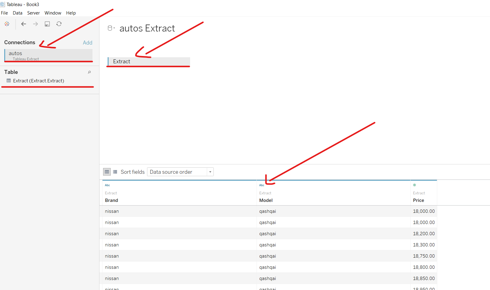

  # <center>How to create a Hyper file with new Hyper API </center>
<center>  </center>
<center>  </center>

Whats is [**Hyper API**](https://www.tableau.com/about/blog/2019/10/deliver-results-hyper-speed)?

Hyper API is evolution of our Extract API. The new API is fully compatible with hyper Tableau extract. The new api is available for Python, C++, Java and C#. For more information check this [**documentation**](https://help.tableau.com/current/api/hyper_api/en-us/index.html)

What is the new features in the **Hyper API**?

One of the big upgrades is to use full CRUD(read, update, delete, and insert) support, and create a sql to intereact with .hyper files. 

1. Full CRUD: Read, update, delete, and insert data in .hyper files.
2. Full speed: Leverage the full speed of Hyper for creating .hyper files.
3. Direct CSV loading: Directly load from .CSV files instead of writing code to do so.
4. SQL-based API: Unleash the power of SQL to interact with .hyper files.
5. Multi-table: Create multi-table extracts that match your data model.


### For more information and uses cases the links below:
[**Delivery Results with Hyper**](https://www.tableau.com/about/blog/2019/10/deliver-results-hyper-speed)

[**Tableau Hyper API**](https://help.tableau.com/current/api/hyper_api/en-us/)


#### As example, I am going to read the csv autos. This csv has 371527 records. To simplify this example, I am going to create a new dataframe with 3 columns.


```python
import pandas as pd
autos = pd.read_csv("autos.csv", encoding='Latin-1')
autos.info()
```

    <class 'pandas.core.frame.DataFrame'>
    RangeIndex: 371528 entries, 0 to 371527
    Data columns (total 20 columns):
    dateCrawled            371528 non-null object
    name                   371528 non-null object
    seller                 371528 non-null object
    offerType              371528 non-null object
    price                  371528 non-null int64
    abtest                 371528 non-null object
    vehicleType            333659 non-null object
    yearOfRegistration     371528 non-null int64
    gearbox                351319 non-null object
    powerPS                371528 non-null int64
    model                  351044 non-null object
    kilometer              371528 non-null int64
    monthOfRegistration    371528 non-null int64
    fuelType               338142 non-null object
    brand                  371528 non-null object
    notRepairedDamage      299468 non-null object
    dateCreated            371528 non-null object
    nrOfPictures           371528 non-null int64
    postalCode             371528 non-null int64
    lastSeen               371528 non-null object
    dtypes: int64(7), object(13)
    memory usage: 56.7+ MB


#### I am going to use the fiels brand, model, and price.


```python
auto_cp = autos[['brand', 'model','price' ]]
```


```python
auto_cp.head()
```


<div>
<style scoped>
    .dataframe tbody tr th:only-of-type {
        vertical-align: middle;
    }

    .dataframe tbody tr th {
        vertical-align: top;
    }

    .dataframe thead th {
        text-align: right;
    }
</style>
<table border="1" class="dataframe">
  <thead>
    <tr style="text-align: right;">
      <th></th>
      <th>brand</th>
      <th>model</th>
      <th>price</th>
    </tr>
  </thead>
  <tbody>
    <tr>
      <th>0</th>
      <td>volkswagen</td>
      <td>golf</td>
      <td>480</td>
    </tr>
    <tr>
      <th>1</th>
      <td>audi</td>
      <td>NaN</td>
      <td>18300</td>
    </tr>
    <tr>
      <th>2</th>
      <td>jeep</td>
      <td>grand</td>
      <td>9800</td>
    </tr>
    <tr>
      <th>3</th>
      <td>volkswagen</td>
      <td>golf</td>
      <td>1500</td>
    </tr>
    <tr>
      <th>4</th>
      <td>skoda</td>
      <td>fabia</td>
      <td>3600</td>
    </tr>
  </tbody>
</table>
</div>


#### The new dataframe was reduced to 3 columns, and the dataframe still have 371528 records.


```python
auto_cp.shape
```


    (371528, 3)


#### Import the Hyper API Library


```python
from tableauhyperapi import HyperProcess, Telemetry, Connection, CreateMode, NOT_NULLABLE, NULLABLE, SqlType,TableDefinition, Inserter, escape_name, escape_string_literal, HyperException, TableName, HyperException
```


```python
from IPython.display import Image #display the image below.
Image(filename="annotation.png")
```


#### The HyperProcess is going to start up a Hyper Database Server local as you can see in the image above.


```python
HyperProcess = HyperProcess(telemetry=Telemetry.DO_NOT_SEND_USAGE_DATA_TO_TABLEAU)
```

#### After that, I am going to create the name of the file and the create mode, in this case with the option create and replace.


```python
connection = Connection(HyperProcess.endpoint, 'autos_r.hyper', CreateMode.CREATE_AND_REPLACE)
```


```python
connection.catalog.create_schema('Extract')
```

#### For more informations about the data types supported in this API consult the link bellow:

[https://help.tableau.com/current/api/hyper_api/en-us/reference/sql/datatype.html]('https://help.tableau.com/current/api/hyper_api/en-us/reference/sql/datatype.html')


```python
schema = TableDefinition( TableName('Extract','Extract'), [
    TableDefinition.Column('brand', SqlType.text()),
    TableDefinition.Column('model', SqlType.text()),
    TableDefinition.Column('price', SqlType.double()),    
])
```


```python
connection.catalog.create_table(schema)
```


```python
inserter = Inserter(connection, schema)
```


```python
for index, row in auto_cp.iterrows():
    inserter.add_row([row['brand'], str(row['model']),row['price']])      
```


```python
inserter.execute()
```

#### It is very important to do a shutdown in the HyperProcess. 


```python
connection.close()
inserter.close()
HyperProcess.shutdown()

print('The Extract Load Ended')

```

    The Extract Load Ended


#### After create the Hyper file, we can open the file in the Tableau.


```python
from IPython.display import Image #display the image below.
Image(filename="Annotation 2019-10-21 204037.png")
```





```python
from IPython.display import Image #display the image below.
Image(filename="Annotation 2019-10-21 204507.png")
```


```python

```
